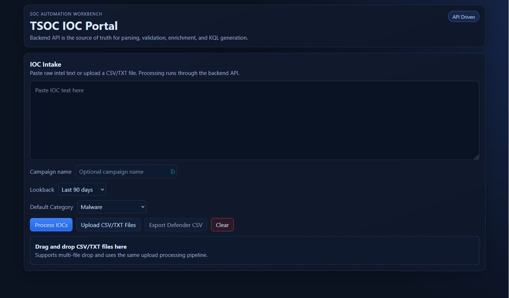
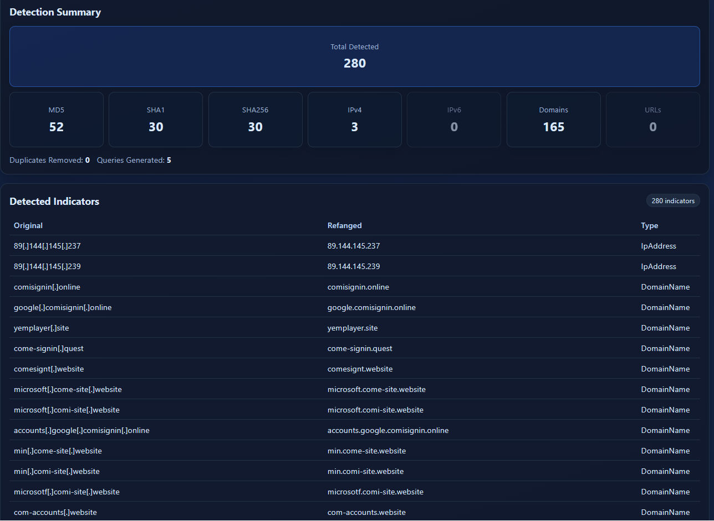
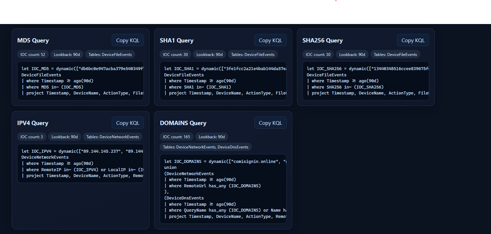
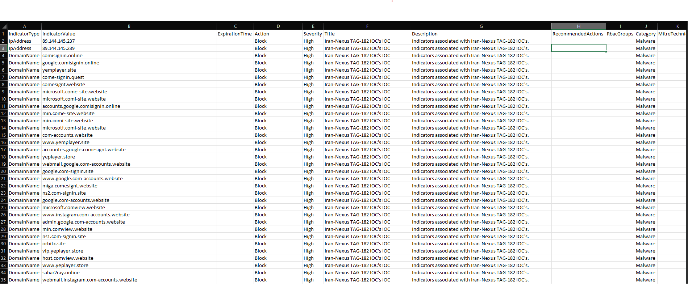

# IOC Workbench

> A full-stack SOC automation platform that transforms raw threat intelligence into Microsoft Defender IOC imports and ready-to-run Advanced Hunting KQL queries.


---

# The Problem

SOC analysts regularly receive Indicators of Compromise (IOCs) from customers, vendors, or threat intelligence feeds in inconsistent formats.

Before these indicators can be imported into Microsoft Defender or used for threat hunting, they often require repetitive manual work:

- Cleaning and normalizing IOC data
- Removing duplicates
- Identifying IOC types
- Creating Microsoft Defender IOC CSV files
- Building Advanced Hunting KQL queries
- Handling multiple campaigns from a single request

IOC Workbench automates this workflow through a modern browser-based interface while keeping all parsing and business logic inside a FastAPI backend.

---

# Features

## IOC Processing

- Paste raw IOC text
- Upload one or more CSV/TXT files
- Drag & Drop file upload
- Automatic IOC normalization and refanging
- Duplicate removal
- IOC type classification
- Campaign detection from uploaded CSV files
- Optional manual campaign override
- Multi-campaign support
- Detection summary dashboard

---

## Microsoft Defender Export

- Microsoft Defender IOC CSV generation
- Automatic Title and Description generation
- Per-campaign metadata support
- Category detection from uploaded intelligence
- Optional manual default category
- Empty ExpirationTime (Never expires)
- Empty RecommendedActions
- Ready for Defender import

---

## Threat Hunting

Generate Microsoft Defender Advanced Hunting KQL queries for:

- MD5
- SHA1
- SHA256
- IPv4
- Domains

Features include:

- Lookback selector
- IOC counters
- Defender table metadata
- One-click copy

---

## User Experience

- Modern React dashboard
- Backend-driven processing
- Drag & Drop uploads
- Processing summary cards
- Loading states
- Friendly validation messages
- Collapsible ignored-items panel
- Clear workflow reset
- Multi-file upload support

---

# Architecture

```
                React Frontend
                       │
                HTTP REST API
                       │
               FastAPI Backend
                       │
 ┌─────────────────────────────────────┐
 │ Parser                             │
 │ Refang                             │
 │ IOC Classification                 │
 │ Deduplication                      │
 │ Campaign Detection                 │
 │ Category Detection                 │
 │ KQL Builder                        │
 │ Defender CSV Generator             │
 └─────────────────────────────────────┘
```

The backend is the **single source of truth** for:

- Parsing
- Validation
- IOC normalization
- Refanging
- Deduplication
- Campaign handling
- Category handling
- KQL generation
- Defender CSV generation

---

# Tech Stack

### Frontend

- React
- Vite
- JavaScript

### Backend

- FastAPI
- Python

### Security

- Microsoft Defender
- Advanced Hunting KQL

---

# Project Structure

```
tsoc-ioc-portal/

├── backend/
│   └── app/
│       ├── parser.py
│       ├── kql_builder.py
│       ├── defender_csv.py
│       └── ...
│
├── frontend/
│   └── src/
│       ├── components/
│       ├── services/
│       └── styles/
│
├── docs/
│   ├── demo.gif
│   └── screenshots/
│
└── README.md
```

---

# Installation

## Backend

```bash
cd backend
pip install -r requirements.txt
uvicorn app.main:app --reload
```

Backend:

```
http://localhost:8000
```

---

## Frontend

```bash
cd frontend
npm install
npm run dev
```

Frontend:

```
http://localhost:5173
```

The frontend reads the backend URL from:

```
VITE_API_BASE_URL
```

Default:

```
http://localhost:8000
```

---

# Usage

1. Paste IOC text or upload CSV/TXT files.
2. (Optional) Enter a campaign name.
3. Select the default Defender category.
4. Choose a lookback period.
5. Click **Process IOCs**.
6. Review:
   - Detection Summary
   - Detected Indicators
   - Generated KQL
7. Export a Microsoft Defender IOC CSV.

---

# Testing

## Backend

```bash
cd backend
pytest
```

## Frontend

```bash
npm test
```

---

# Screenshots

## IOC Intake



---

## Detection Summary



---

## KQL Builder



---

## Microsoft Defender Export



---

# Demo


---

# Roadmap

Future improvements may include:

- VirusTotal integration
- MISP integration
- Additional IOC types
- Additional SIEM/XDR export formats
- Azure deployment
- Public hosted version

---

# Current Release

**Version:** `v1.0.0`

---

# License

MIT License